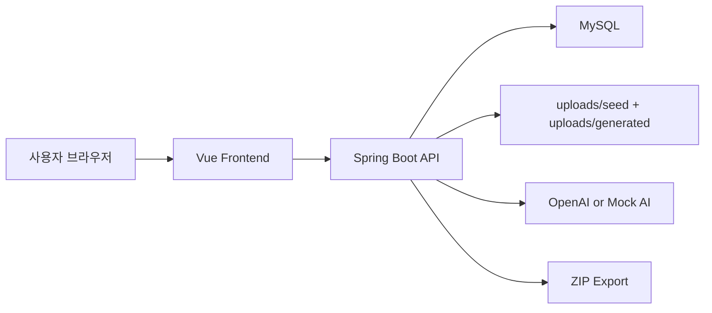

# Sweetbook

## 1. 서비스 소개

Sweetbook은 사용자가 올린 그림과 아이 이름, 상상 프롬프트를 바탕으로 AI 동화를 만들고, 그 동화를 책 주문과 ZIP 익스포트까지 이어서 확인할 수 있는 그림책 생성 서비스입니다.

### 타겟 사용자
- 아이를 위한 맞춤형 동화를 빠르게 만들어보고 싶은 부모
- 직접 그린 그림으로 짧은 그림책을 만들고 싶은 보호자/가족
- AI 생성 콘텐츠를 “읽기 → 주문 → 데이터 추출” 흐름으로 보고 싶은 서비스 기획/운영 관점 사용자

### 주요 기능
- 그림 업로드 + 아이 이름 + 상상 프롬프트로 동화 생성
- 동화 목록 조회 / 상세 조회
- 페이지 본문 수정
- 페이지 일러스트 재생성 / 실패한 동화 재시도
- 동화 기반 책 주문 생성
- 주문 상태 전이 관리
- 주문 단위 ZIP export

## 2. 실행 방법 (Docker)

기본 실행은 **API 키 없이도 동작**하도록 되어 있습니다.  
평가자는 아래 명령만 복사-붙여넣기 하면 바로 실행할 수 있습니다.

### 기본 실행

```bash
# 저장소 클론
git clone https://github.com/BigJins/sweetbook-storybook.git

# 프로젝트 폴더로 이동
cd sweetbook-storybook

# 환경변수 파일 준비
cp .env.example .env

# 실행
docker compose up --build

# 접속
http://localhost:8080
```

설명:
- 기본값은 `AI_MOCK_MODE=true` 입니다.
- 즉, `OPENAI_API_KEY` 없이도 시드 데이터 확인 / 동화 생성 / 주문 / ZIP 다운로드 흐름을 바로 볼 수 있습니다.

### 포트를 바꾸고 싶을 때

`.env` 파일에서 아래 값을 바꾼 뒤 다시 실행하면 됩니다.

```env
APP_PORT=8080
DB_PORT=3306
DB_PASSWORD=sweetbook
OPENAI_API_KEY=
AI_MOCK_MODE=true
```

예를 들어 앱 포트를 `9090`, DB 포트를 `3307`로 바꾸려면:

```env
APP_PORT=9090
DB_PORT=3307
DB_PASSWORD=sweetbook
OPENAI_API_KEY=
AI_MOCK_MODE=true
```

그 다음 실행:

```bash
docker compose up --build
```

접속 주소:

```text
http://localhost:9090
```

### 실제 AI 모드로 실행하고 싶을 때

`.env` 에 API 키를 넣고 mock mode를 끄면 됩니다.

```env
OPENAI_API_KEY=sk-...
AI_MOCK_MODE=false
```

그 다음 다시 실행:

```bash
docker compose up --build
```

주의:
- 제출/평가 기본 경로는 `mock mode` 입니다.
- 실제 AI 모드는 선택 실행 경로입니다.

## 3. 완성한 레벨

### Lv1. 콘텐츠 생성
구현한 내용:
- 동화 생성 API 및 UI
- 동화 목록 / 상세 조회
- 생성 상태 polling
- 페이지 본문 수정
- 페이지 재생성 / 실패 시 재시도

### Lv2. 자체 주문 기능
구현한 내용:
- 동화 기반 주문 생성
- 주문 목록 조회
- 주문 상태 전이
  - `PENDING -> PROCESSING -> COMPLETED`

### Lv3. 주문 데이터 익스포트
구현한 내용:
- 주문별 ZIP 다운로드
- 이미지, 메타데이터, 스토리 JSON 포함
- 주문 단위로 외부 전달 가능한 산출물 구성

결론:
- **Lv3까지 구현 완료**했습니다.

## 4. 기술 스택 및 아키텍처

### 기술 스택

#### Frontend
- Vue 3
- Vue Router 4
- TypeScript
- Vite 6
- Tailwind CSS
- Vitest

#### Backend
- Java 21
- Spring Boot 3.5.0
- Spring Web
- Spring Data JPA
- Spring Validation
- Spring WebFlux (`WebClient`)
- Flyway

#### Database / Infra
- MySQL 8
- H2 (test)
- Docker Compose

### 왜 이 스택을 선택했는지

#### Backend: Spring Boot + JPA + Flyway
- 과제 요구사항이 REST API, 상태 전이, 주문/익스포트, DB 마이그레이션을 포함하고 있어 Java/Spring 조합이 안정적이었습니다.
- `Spring Boot`는 빠르게 REST + Validation + 테스트 기반 개발을 진행하기 좋았습니다.
- `JPA`는 Story / Page / Order / OrderItem 같은 관계형 모델을 다루기에 적합했습니다.
- `Flyway`를 써서 스키마와 시드 데이터를 명시적으로 관리했습니다.

비교:
- Node/NestJS도 가능했지만, 이번 과제는 상태 전이/DB 중심 로직이 많아 Spring 쪽이 더 익숙하고 검증 비용이 낮았습니다.

#### Frontend: Vue 3 + Vite
- 빠르게 화면을 붙이고 상태를 단순하게 관리하기 위해 Vue 3를 선택했습니다.
- 동화 목록, 상세 뷰어, 주문 보드처럼 컴포넌트 단위 분리가 명확한 화면에 잘 맞았습니다.
- Vite는 개발 속도와 설정 단순성이 장점이었습니다.

비교:
- React도 선택지였지만, 이번 과제에서는 빠른 생산성과 뷰 계층 구성 속도를 더 우선했습니다.

#### MySQL + Docker Compose
- 제출자가 아닌 평가자도 같은 방식으로 재현 가능해야 하므로 Docker Compose를 사용했습니다.
- MySQL은 운영과 가까운 관계형 DB 환경을 바로 보여주기에 적합했습니다.

### 주요 디렉터리 구조

```text
sweetbook-storybook/
├─ backend/
│  ├─ src/main/java/com/sweetbook
│  │  ├─ config
│  │  ├─ domain
│  │  │  ├─ order
│  │  │  └─ story
│  │  ├─ repository
│  │  ├─ service
│  │  │  └─ ai
│  │  └─ web
│  └─ src/main/resources
│     ├─ db/migration
│     └─ seed
├─ frontend/
│  └─ src
│     ├─ api
│     ├─ components
│     ├─ composables
│     ├─ router
│     └─ views
├─ docs/
├─ uploads/
├─ docker-compose.yml
├─ CLAUDE.md
└─ AGENTS.md
```

### 아키텍처 다이어그램



## 5. AI 도구 사용 내역

이번 과제는 AI 도구를 적극 활용해 구현했습니다.  
다만 “생각 없이 생성”이 아니라, 기획/병렬 작업/리뷰/검증 단계마다 역할을 나눠 사용했습니다.

### 5-1. 개발 과정에서 사용한 AI 도구

#### Claude
- 오늘 작업 중 일시적으로 장애가 있었지만, 전체적으로는 주 구현 에이전트로 활용했습니다.
- `gstack` 기반으로 작업 문맥을 분리해 기획과 구현을 나눴습니다.
- 단계별 기획서와 에이전트 프롬프트를 읽히고 구현을 맡겼습니다.
- `Git worktrees` 기반으로 백엔드/프론트 병렬 작업 흐름을 운영했습니다.
- 서브에이전트를 분리해 백엔드/프론트/검증 역할을 나눴습니다.

#### Codex
- 리뷰 에이전트 / 검증 에이전트처럼 사용했습니다.
- API 계약 검증, 문서 충돌 검토, 시드 데이터 정리, 실행 흐름 점검에 활용했습니다.

#### Superpowers
- 초반 브레인스토밍과 서비스 방향 정리에 활용했습니다.
- 특히 “길 A / 길 B”처럼 구현 방향을 비교할 때 사고 정리에 도움을 받았습니다.

### 사용하지 않은 것
- Figma 같은 별도 목업 툴은 사용하지 않았습니다.
- 프런트 화면은 바로 코드로 붙이는 방식으로 진행했습니다.

### 긍정적이었던 점
- 설계 문서와 작업 범위를 먼저 잠그고 들어가니 병렬 개발이 덜 꼬였습니다.
- 기획 / 구현 / 리뷰를 분리하니 문맥 오염이 줄었습니다.
- Docker, API 계약, 시드 데이터 같은 제출 핵심 포인트를 반복 검증할 수 있었습니다.

### 아쉬웠던 점 / 실패 경험
- Claude 장애로 중간에 재시도가 필요했던 순간이 있었습니다.
- 스테이징된 변경이 섞여 커밋 메시지와 diff 범위가 어긋난 적이 있었습니다.
- 이미지/시드 복사 캐시, 한글 인코딩, 브라우저 캐시 같은 문제는 결국 직접 끝까지 확인해야 했습니다.

### 5-2. 서비스 기능으로 사용한 AI

이 서비스 자체도 AI를 사용합니다.

#### 사용 목적
- 업로드한 그림에서 주 피사체와 분위기, 장면 단서를 분석
- 그 분석 결과를 바탕으로 동화 본문 생성
- 각 페이지용 일러스트 프롬프트 생성
- 최종 페이지 이미지 생성

#### 현재 구성
- Vision: `gpt-4o`
- Text: `gpt-4o-mini`
- Image: `gpt-image-1`

#### 동작 방식
1. 사용자가 그림을 업로드합니다.
2. Vision 모델이 그림의 주 피사체, 분위기, 장면 단서를 분석합니다.
3. Text 모델이 그 분석 결과와 사용자 상상 프롬프트를 바탕으로 동화 본문을 생성합니다.
4. Image 모델이 페이지별 일러스트를 생성합니다.

#### 제출 안정성을 위한 설계
- 평가 환경에서 API 키가 없을 가능성을 고려해 `mock mode` 를 기본값으로 유지했습니다.
- 따라서 제출본은 **API 키 없이도 실행 가능**합니다.
- API 키를 제공하면 `real AI mode` 로 실제 생성 경로를 확인할 수 있습니다.

즉, 이번 과제에서는
- **개발 과정에서도 AI 도구를 사용했고**
- **서비스 기능 자체도 AI를 활용하도록 구현했습니다.**

## 6. 설계 의도

### 왜 이 서비스 아이디어를 선택했는지
- “AI가 만든 결과물이 실제 서비스 흐름으로 이어지는가”를 보여주고 싶었습니다.
- 단순히 이미지나 텍스트만 생성하는 데서 끝나는 것이 아니라,
  - 생성
  - 수정
  - 주문
  - 익스포트
까지 이어지는 전체 플로우를 과제로 보여주는 것이 더 설득력 있다고 판단했습니다.

### 이 서비스의 사업적 가능성
- 아이 그림 + 보호자 입력을 바탕으로 개인화된 동화를 만들 수 있다는 점에서 선물/추억 상품화 가능성이 있습니다.
- 디지털 콘텐츠에서 끝나지 않고 “책 주문”으로 연결되기 때문에 소장 가치가 생깁니다.
- 장기적으로는:
  - 월간 동화 구독
  - 육아 기록 연동
  - 성장 앨범형 콘텐츠
로 확장 가능성이 있다고 봤습니다.

### 더 시간이 있었다면 추가했을 기능
- 더 자연스러운 spread 전용 일러스트 구도 생성
- 모바일에서 더 강한 그림책 리더 UX
- 주문 이력 상세 / 배송 상태 확장
- 관리자용 시드/콘텐츠 운영 기능
- 생성 품질 개선을 위한 캐릭터 일관성 유지

## 7. 제출에서 꼭 표현하고 싶은 포인트

- **기본 실행은 API 키 없이 바로 된다**  
  평가자는 `docker compose up --build` 만으로 확인 가능합니다.

- **mock mode + 시드 데이터 전략**  
  제출 안정성을 위해 mock mode를 기본값으로 두고, 바로 볼 수 있는 시드 동화를 함께 제공했습니다.

- **real AI mode도 별도로 구현했다**  
  API 키가 있으면 실제 OpenAI 경로로 그림 분석 / 동화 생성 / 이미지 생성을 확인할 수 있습니다.

- **Lv3까지 구현 완료했다**  
  생성, 주문, ZIP export까지 하나의 흐름으로 닫았습니다.

- **AI 도구를 체계적으로 사용했다**  
  단순 보조가 아니라, 기획 / 병렬 구현 / 리뷰 / 검증 프로세스를 나눠 운영했습니다.

- **최종적으로는 직접 검증했다**  
  Docker 실행, 시드 데이터, 인코딩, 이미지 경로, ZIP 산출물 등은 직접 확인하고 정리했습니다.
