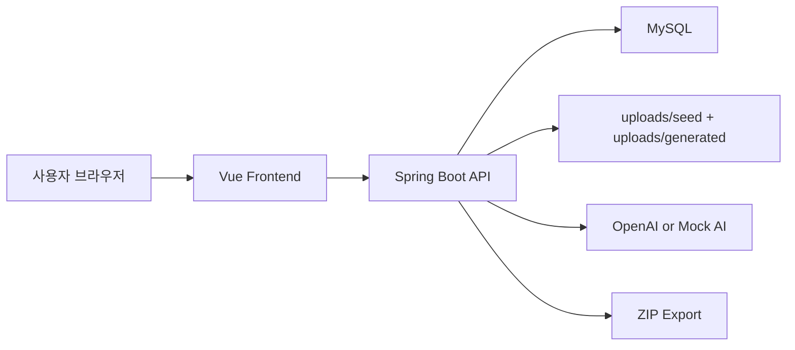

# Sweetbook

## 1. 서비스 소개

Sweetbook은 아이가 그린 그림과 짧은 상상을 바탕으로 AI 동화를 만들고, 그 결과를 책 주문과 ZIP export까지 이어서 확인할 수 있는 그림책 제작 서비스입니다.

### 타겟 사용자
- 아이를 위한 맞춤형 동화를 빠르게 만들어 보고 싶은 부모
- 아이가 직접 그린 그림을 콘텐츠로 남기고 싶은 가족
- AI 생성 콘텐츠가 주문과 데이터 export까지 어떻게 이어지는지 보고 싶은 기획자/운영자

### 주요 기능
- 그림 업로드 + 아이 이름 + 상상 프롬프트로 동화 생성
- 동화 목록 조회 / 상세 조회
- 페이지 본문 수정
- 페이지 일러스트 재생성 / 실패한 동화 재시도
- 동화 기반 책 주문 생성
- 주문 상태 관리
- 주문 단위 ZIP export

---

## 2. 실행 방법 (Docker)

기본 실행은 **API 키 없이도 바로 동작**하도록 구성되어 있습니다.  
아래 명령만 복사-붙여넣기 하면 바로 확인할 수 있습니다.

### 기본 실행

```bash
# 저장소 클론
git clone https://github.com/BigJins/sweetbook-storybook.git

# 프로젝트 폴더로 이동
cd sweetbook-storybook

# 환경변수 준비
cp .env.example .env

# 실행
docker compose up --build

# 접속
http://localhost:8080
```

### mock mode / real AI mode

기본값은 아래와 같습니다.

```env
APP_PORT=8080
DB_PORT=3306
DB_PASSWORD=sweetbook
OPENAI_API_KEY=
AI_MOCK_MODE=true
```

- `AI_MOCK_MODE=true`
  - 평가용 기본 모드
  - API 키 없이 실행 가능
  - 홈 화면에는 시드 동화 2편만 노출
  - `새 동화 만들기`는 **고정 데모 시나리오**로 동작
    - 고정 그림
    - 고정 아이 이름
    - 고정 상상 프롬프트
    - 고정 결과
    - 생성 과정은 그대로 보여줌
- `AI_MOCK_MODE=false`
  - 실제 OpenAI 기반 생성 모드
  - `OPENAI_API_KEY` 필요
  - 사용자가 입력한 그림 / 이름 / 상상을 바탕으로 실제 생성

### 포트 변경 방법

`.env` 값만 바꾸면 됩니다.

예를 들어 앱 포트를 `9090`, DB 포트를 `3307`로 바꾸려면:

```env
APP_PORT=9090
DB_PORT=3307
DB_PASSWORD=sweetbook
OPENAI_API_KEY=
AI_MOCK_MODE=true
```

다시 실행:

```bash
docker compose up --build
```

접속 주소:

```text
http://localhost:9090
```

### 실제 AI 모드 실행 방법

```env
OPENAI_API_KEY=sk-...
AI_MOCK_MODE=false
```

그다음 다시 실행:

```bash
docker compose up --build
```

주의:
- 제출/평가 기본 경로는 `mock mode`
- 실제 AI 모드는 선택 실행 경로

### 실제 AI 생성 데모 영상

- [real AI mode 데모 영상 보기](https://drive.google.com/file/d/1z2S2D8pJ4x8bCG-1X1JsvuUx_i77rZVH/view?usp=sharing)
- 이 영상에서는 사용자가 직접 그림을 업로드하고 실제 OpenAI 경로로 동화를 생성한 뒤 주문과 ZIP export까지 이어지는 흐름을 확인할 수 있습니다.

---

## 3. 완성한 레벨

### Lv1. 서비스 구현
구현한 내용:
- 동화 생성 API 및 UI
- 동화 목록 / 상세 조회
- 생성 상태 polling
- 페이지 본문 수정
- 페이지 일러스트 재생성 / 재시도

### Lv2. 자체 주문 기능
구현한 내용:
- 동화 기반 주문 생성
- 주문 목록 조회
- 주문 상태 전이
  - `PENDING -> PROCESSING -> COMPLETED`

### Lv3. 주문 데이터 익스포트
구현한 내용:
- 주문별 ZIP 다운로드
- 이미지, 메타데이터, 스토리 JSON 포함
- 주문 단위로 프린트 전달이 가능한 구조화된 결과물 생성

결론:
- **Lv3까지 구현 완료**

---

## 4. 기술 스택 및 아키텍처

### 기술 스택

#### Frontend
- Vue 3
- Vue Router 4
- TypeScript
- Vite 6
- Tailwind CSS
- Vitest

#### Backend
- Java 21
- Spring Boot 3.5
- Spring Web
- Spring Data JPA
- Spring Validation
- Spring WebFlux (`WebClient`)
- Flyway

#### Database / Infra
- MySQL 8
- H2 (test)
- Docker Compose

### 왜 이 스택을 선택했는지

#### Backend: Spring Boot + JPA + Flyway
- 과제 요구사항이 REST API, 상태 전이, 주문/익스포트, DB 마이그레이션을 포함하고 있어 Java/Spring 조합이 안정적이었습니다.
- `Spring Boot`는 REST + Validation + 테스트 기반 개발을 빠르게 진행하기 좋았습니다.
- `JPA`는 Story / Page / Order / OrderItem 같은 관계형 모델을 다루기에 적합했습니다.
- `Flyway`를 사용해 스키마와 시드 데이터를 명시적으로 관리했습니다.

비교:
- Node/NestJS도 가능했지만, 이번 과제에서는 상태 전이와 DB 중심 로직이 많아 Spring 쪽이 더 단순하고 검증 비용이 낮았습니다.

#### Frontend: Vue 3 + Vite
- 제한된 시간 안에 화면을 빠르게 구성하고 컴포넌트 단위로 나누기 위해 Vue 3를 선택했습니다.
- 동화 목록, 상세 뷰어, 주문 보드처럼 컴포넌트 단위 분리가 명확한 화면에 잘 맞았습니다.
- Vite는 개발 속도와 설정 단순성이 장점이었습니다.

비교:
- React도 선택지였지만, 이번 과제에서는 빠른 생산성과 뷰 구성 속도를 우선했습니다.

#### MySQL + Docker Compose
- 심사자 환경에서 같은 방식으로 재현 가능해야 하므로 Docker Compose를 사용했습니다.
- MySQL은 운영에 가까운 관계형 DB 환경을 바로 보여주기에 적합했습니다.

### 주요 디렉터리 구조

```text
sweetbook-storybook/
├─ backend/
│  ├─ src/main/java/com/sweetbook
│  │  ├─ config
│  │  ├─ domain
│  │  │  ├─ order
│  │  │  └─ story
│  │  ├─ repository
│  │  ├─ service
│  │  │  └─ ai
│  │  └─ web
│  └─ src/main/resources
│     ├─ db/migration
│     ├─ mock
│     └─ seed
├─ frontend/
│  └─ src
│     ├─ api
│     ├─ components
│     ├─ composables
│     ├─ router
│     └─ views
├─ docs/
├─ uploads/
├─ docker-compose.yml
├─ CLAUDE.md
└─ AGENTS.md
```

### 아키텍처 다이어그램



---

## 5. AI 도구 사용 내역

이번 과제는 AI 도구를 전체적으로 사용해 구현했습니다.  
다만 생성만 맡기는 방식이 아니라 기획/병렬 작업/리뷰/검증 단계마다 역할을 나눠 사용했습니다.

### 5-1. 개발 과정에서 사용한 AI 도구

#### Claude
- 단계별 기획서 작성
- `gstack` 기반 문맥 분리
- Git worktrees 기반 병렬 작업
- 백엔드/프론트 구현 에이전트 분리
- 리뷰/검증 프롬프트 실행

#### Codex
- 코드 리뷰 에이전트
- 검증 에이전트
- README / 시드 정리 / 데모 모드 정리

#### Superpowers
- 초반 브레인스토밍
- 서비스 방향 비교
- 화면/플로우 아이디어 정리

#### 사용하지 않은 것
- Figma 같은 별도 목업 도구는 사용하지 않았습니다.
- 화면 목업보다 바로 코드로 구현하는 방식으로 진행했습니다.

### 5-2. 서비스 기능으로 사용한 AI

서비스 자체도 AI 기능을 포함합니다.

#### real AI mode
- 업로드한 그림 분석
- 주 피사체 / 분위기 / 장면 단서 추출
- 동화 본문 생성
- 페이지별 일러스트 프롬프트 생성
- 표지 / 본문 페이지 이미지 생성

#### mock mode
- 평가 환경 안정성을 위해 기본값은 `AI_MOCK_MODE=true`
- API 키 없이도 전체 흐름을 볼 수 있도록 구성
- 홈에는 전시용 시드 2편만 노출
- `새 동화 만들기`는 고정 데모 시나리오로 동작

#### 개발 중 느낀 점
- 장점:
  - 초기 구조 설계와 반복 구현 속도가 빨랐습니다.
  - 리뷰 에이전트를 따로 두면서 범위 이탈을 줄일 수 있었습니다.
- 단점:
  - Claude 서비스 장애/지연이 있을 때 작업 흐름이 끊겼습니다.
  - 잘못된 staged 상태나 인코딩 이슈처럼, 사람이 마지막 확인을 꼭 해야 하는 구간이 있었습니다.

---

## 6. 설계 의도

### 왜 이 서비스 아이디어를 선택했는지

아이 그림은 가족에게는 의미가 크지만, 대부분 사진처럼 저장만 되고 다시 소비되지는 않습니다.  
그래서 “아이 그림을 동화로 바꾸고, 그것을 다시 책 주문과 데이터 결과물로 연결하는 서비스”가 과제 범위 안에서 명확한 사용자 가치를 보여줄 수 있다고 판단했습니다.

### 이 서비스의 사업적 가능성

- 개인 맞춤형 그림책 제작 수요는 꾸준히 존재합니다.
- AI 기반 자동화가 붙으면 1회성 이벤트가 아니라 반복 구매 경험으로 이어질 수 있습니다.
- 단순 생성 서비스에서 끝나지 않고, 주문/제작/배송/보관까지 이어지는 운영형 서비스로 확장 가능성이 있습니다.

### 더 시간이 있었다면 추가했을 기능

- 실제 결제 기능
- 사용자 계정/저장 기능
- 여러 권 주문 / 장바구니
- 더 다양한 그림책 레이아웃
- 이미지 saliency 기반 텍스트 위치 최적화
- 생성 이력 비교 및 버전 관리

---

## 7. 그후 꼭 표현하고 싶은 것들

- 이 과제는 **Lv3까지 실제 동작하는 흐름**을 구현하는 데 집중했습니다.
- 제출 기본 경로는 **mock mode 기반의 안정적인 데모**로 설계했습니다.
- 동시에 **real AI mode**도 구현해 실제 AI 생성 결과를 영상으로 확인할 수 있게 했습니다.
- 홈 화면의 시드 동화는 전시용 콘텐츠이고, mock 모드의 `새 동화 만들기`는 평가용 고정 데모 플로우입니다.
- 개발 과정에서는 AI를 기획, 구현, 검증에 적극 활용했지만, 마지막 구조 결정과 품질 판단은 직접 수행했습니다.
